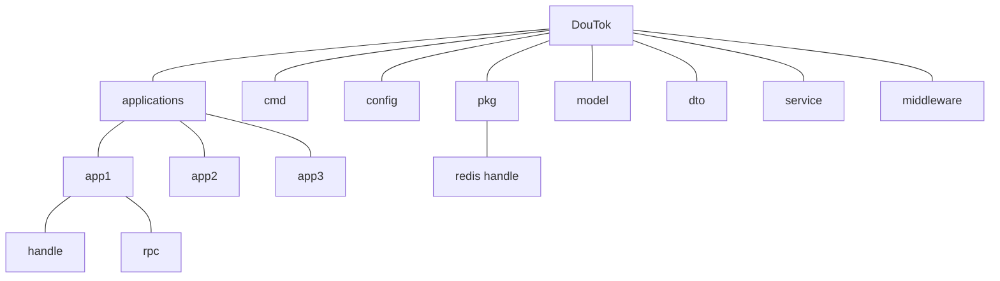

# DouTok 部分设计文档

[TOC]

## 包划分

## 模块划分

api

> 网关入口，接收http请求，转发到微服务端获取结果

user

> 用户管理微服务
> 主要服务接口：
> /douyin/user/register/
> /douyin/user/login/
> /douyin/user/

relation

> 关系管理微服务
> 主要服务接口：
> /douyin/relation/action/
> /douyin/relation/follow/list/
> /douyin/relation/follower/list/
> /douyin/relation/friend/list/

feed

> 视频流功能微服务
> 主要服务接口：
> /douyin/feed/

publish

> 视频发布功能微服务
> 主要服务接口：
> /douyin/publish/list/
> /douyin/publish/action/

favorite

> 点赞功能微服务
> 主要服务接口：
> /douyin/favortie/action/
> /douyin/favortite/list/

comment

> 评论功能微服务
> 主要服务接口：
> /douyin/comment/action/
> /douyin/comment/list/

message

> 私信功能微服务
> 主要服务接口：
> socket
> /douyin/message/chat/
> /douyin/message/action/

## 存储方案

hbase：

聊天记录表、评论表、关注表、粉丝表、点赞表、视频表

mysql：

用户信息表（不包括点赞数、关注数等）、用户count表（点赞数、粉丝数等）
