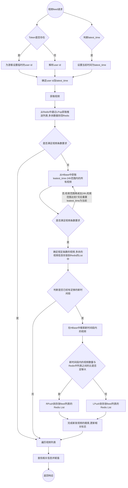

# 接口逻辑

## Feed流

```mermaid
graph TD
    req((视频feed请求))

    jToken{Token是否存在}

    req --> jToken

    setUserId[为游客设置临时的user id]
    parseUserId[解析user id]

    jToken -- 是 --> setUserId
    jToken -- 否 --> parseUserId

    jLTime{判断latest_time}
    setCurr[设置当前时间为latest_time]

    req --> jLTime
    jLTime -- 是 --> setCurr

    sure[确定user id及latest_time]

    setUserId --> sure
    parseUserId --> sure
    setCurr --> sure

    get[获取视频]
    reverse[遍历视频列表]
    sure --> get

    getRedis[从Redis中通过LPop获取推送列表,多余数据存回Redis]
    jGRedis{是否满足视频条数要求}

    get --> getRedis
    getRedis --> jGRedis

    jGRedis -- 是 --> reverse

    getHB[从HBase中获取leatest_time-24h范围内的所有视频]
    jGRedis -- 否 --> getHB

    getHB --> jGHB

    jGHB{是否满足视频条数要求}
    jGHB -- 否,检索范围再减去24h,检索范围达到7天后重置leatest_time为当前 --> getHB

    inRedis[确定规定条数的视频,多余的视频信息存放到Redis的List中]

    jEnough{判断是否已经有足够的新时间段}
    jGHB -- 是 --> inRedis

    inRedis --> jEnough
    jEnough -- 否 --> reverse

    getHBNew[在HBase中搜索新时间段内的视频]
    jEnough -- 是 --> getHBNew

    jMany{新时间段内的视频数量与Redis中列表之间的比是否足够大}
    getHBNew --> jMany

    rp[RPush到存放feed列表的Redis List]
    lp[LPush到存放feed列表的Redis List]

    finish[完成新发视频的搜索,更新相关标志]
    rp --> finish
    lp --> finish

    finish --> reverse
    jMany -- 是 --> rp
    jMany -- 否 --> lp

    info[查找相关信息并赋值]
    reverse --> info

    res((返回响应))
    info --> res
```
