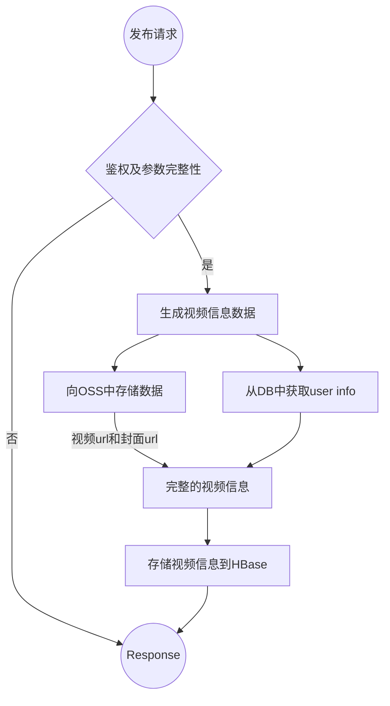
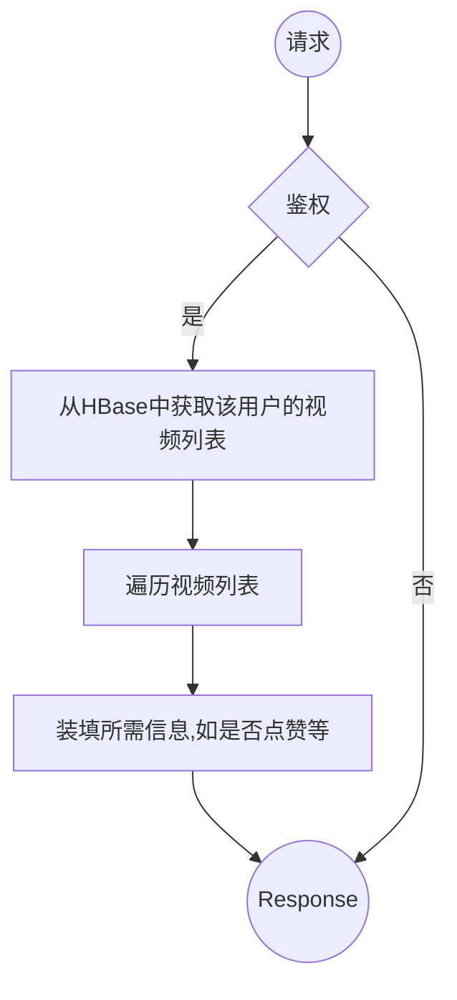

# Publish逻辑

## action

```mermaid
graph TD
    req((发布请求))

    judge{鉴权及参数完整性}

    req --> judge
    judge -- 否 --> res

    video[生成视频信息数据]
    judge -- 是 --> video

    oss[向OSS中存储数据]
    video --> oss

    all[完整的视频信息]
    oss -- 视频url和封面url --> all

    db[从DB中获取user info]
    video --> db
    db --> all

    save[存储视频信息到HBase]
    all --> save

    save --> res

    res((Response))
```

## list

```mermaid
graph TD
    req((请求))

    judge{鉴权}

    req --> judge

    getHB[从HBase中获取该用户的视频列表]
    judge -- 是 --> getHB

    reverse[遍历视频列表]
    msg[装填所需信息,如是否点赞等]

    getHB --> reverse
    reverse --> msg

    msg --> res

    res((Response))
    judge -- 否 --> res
```
